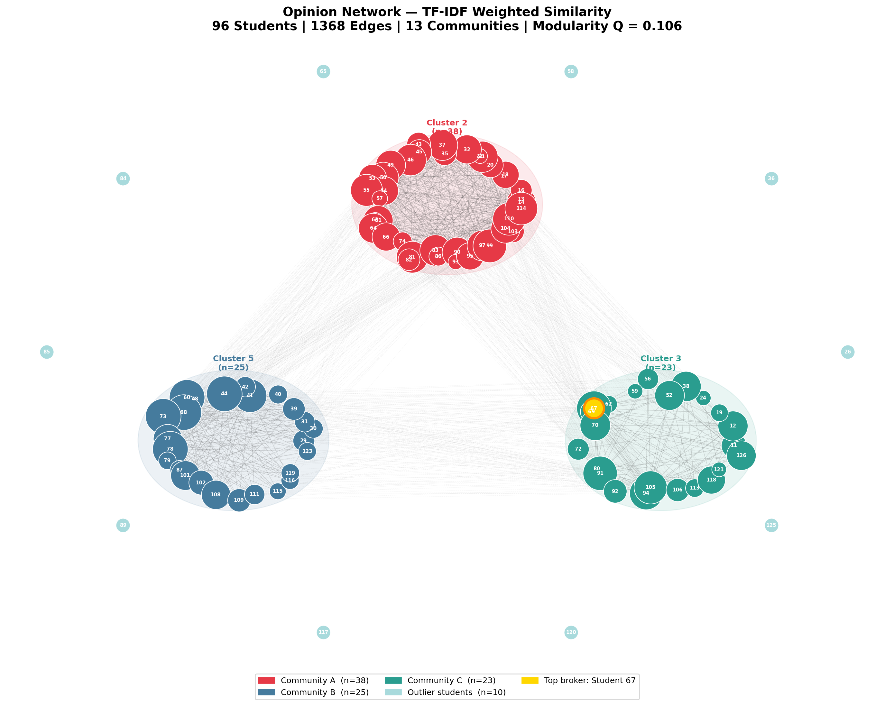
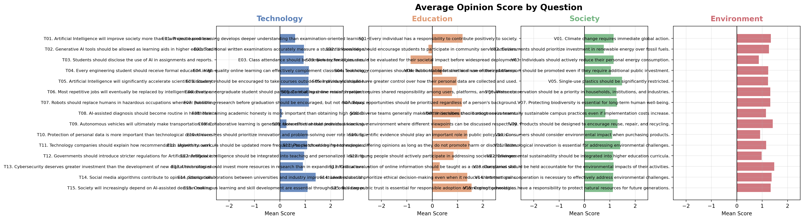
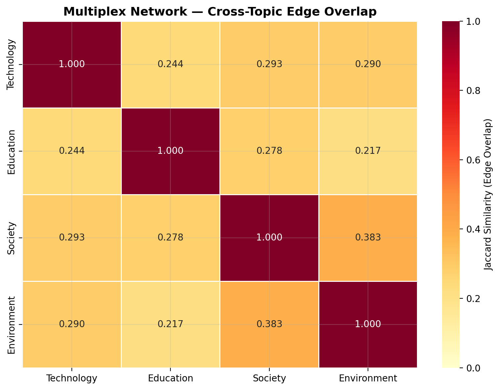
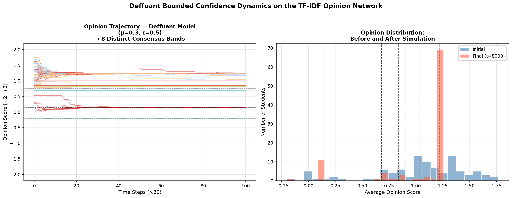

# Team Name

**[Add Your Team Name Here]**

---

# GitHub Link to Your Code

**Repository:** [Insert your GitHub repository URL here]

> The repository contains: `Opinion_Network_Analysis.ipynb` (the full annotated Jupyter Notebook), `run_analysis_and_save.py` (the standalone execution script), and `dataset.csv` (the survey data). All plots are generated reproducibly by running either of these files.

---

# Dataset Documentation

The dataset contains survey responses from **96 students**, each answering **60 questions** (15 per topic) on the following four categories:

| Code | Topic | No. of Questions |
|------|-------|-----------------|
| T01–T15 | Technology & Artificial Intelligence | 15 |
| E01–E15 | Education & Academia | 15 |
| S01–S15 | Society & Ethics | 15 |
| V01–V15 | Environment & Sustainability | 15 |

Each question was answered on a **5-point Likert scale**: Strongly Disagree, Disagree, Neutral, Agree, Strongly Agree. A small number of responses were marked "No Comments."

**Preparation & Encoding:**

1. **Numerical mapping:** We mapped responses to signed integers to capture opinion direction: `Strongly Disagree → −2`, `Disagree → −1`, `Neutral → 0`, `Agree → +1`, `Strongly Agree → +2`. "No Comments" was mapped to `0` (treated as Neutral/abstention).
2. **Baseline sentiment:** The average scores show that the class held *consistently positive* views across all topics:
   - Technology: **+0.928** | Education: **+0.819**
   - Society: **+1.151** | Environment: **+1.226**

   Environment and Society questions received the strongest agreement overall, while Education responses showed the most nuanced spread.

3. **Positive-shifting for TF-IDF:** To apply TF-IDF (which requires non-negative counts), the values were shifted from [−2, +2] to [1, 5], preserving relative magnitudes.

---

# Pipeline Followed

Our pipeline is innovative because it goes **beyond standard cosine similarity**. We use three complementary approaches that are central to the theme of this course: *network construction*, *static network analysis*, and *dynamical processes on networks*.

## Step 1: TF-IDF Weighted Similarity Network

Instead of treating all shared opinions equally, we applied **Term Frequency-Inverse Document Frequency (TF-IDF)** — borrowing from Natural Language Processing — where each student is a "document" and each survey response is a "term." TF-IDF assigns a lower weight to responses that the *majority* of the class agreed on (e.g., almost everyone agreed that climate change requires action), and a *higher weight* to rare, distinguishing opinions. This ensures that the resulting edge weights reflect **genuine ideological proximity**, not just agreement on obvious or uncontroversial topics.

After computing pairwise cosine similarity on the TF-IDF representations, we applied a **70th percentile threshold** to retain only the strongest 30% of potential connections, forming the backbone of the opinion network.

## Step 2: Community Detection (Louvain Algorithm)

We applied the **Louvain algorithm** — a modularity-maximization method — to detect communities within the TF-IDF network. The Louvain algorithm partitions nodes into communities that maximize intra-community edge density relative to chance (measured by the **modularity score Q**).

## Step 3: Multiplex Network Analysis (4-Layer)

We constructed a **4-layer multiplex network** — one layer each for Technology, Education, Society, and Environment — to study whether opinions are correlated *across topics*. A high Jaccard edge-overlap between two layers means students who agree ideologically on one topic also tend to agree on another. This multi-layer approach captures structural nuances that a single aggregate network cannot.

## Step 4: Opinion Dynamics — Deffuant Bounded Confidence Model

As this course focuses on *dynamical processes*, we simulated how classroom consensus (or fragmentation) would emerge if students interacted and influenced each other. We used the **Deffuant model**:

- Each student is assigned an initial opinion state equal to their average score across all 60 questions.
- At each time step, a random connected pair $(u, v)$ is selected. If their opinions differ by less than the confidence threshold $\varepsilon = 0.5$, they update toward each other: $x_u \leftarrow x_u + \mu(x_v - x_u)$, with convergence rate $\mu = 0.3$.
- The simulation runs for **8,000 steps** on the TF-IDF network.
- A GIF animation (`opinion_dynamics.gif`) visually shows how node colours (red=disagree, green=agree) shift across the network over time.

---

# Analysis and Visualizations

## Network Metrics Summary

| Metric | Value |
|--------|-------|
| Nodes (students) | 96 |
| Edges (strong ideological links) | 1,368 |
| Network Density | 0.30 |
| Average Degree | 28.50 |
| Average Clustering Coefficient | 0.678 |
| Connected Components | 11 |
| Communities (Louvain) | 13 |
| Modularity (Q) | 0.106 |

The network has a **density of 0.30**, meaning 30% of all possible connections are present — indicating a moderately dense community with widespread opinion sharing. The high **average clustering coefficient of 0.678** confirms that the network has a strong "clique" structure: if students A and B both agree strongly with student C, they very likely agree with each other too. The **11 connected components** reveal that a small number of students (those with highly divergent or rare opinions) are ideological outliers who share strong connections with no one in the main cluster.

## Centrality: Opinion Influencers

We compute two complementary centrality measures:

**Degree Centrality** (who shares the most TF-IDF-weighted links — the "broadest connectors"):

| Rank | Student | Degree Centrality |
|------|---------|-------------------|
| 1 | Student 44 | 0.7368 |
| 2 | Student 60 | 0.7368 |
| 3 | Student 68 | 0.7368 |
| 4 | Student 73 | 0.7368 |
| 5 | Student 78 | 0.7368 |

**Betweenness Centrality** (who acts as the structural bridge between communities — the "opinion brokers"):

| Rank | Student | Betweenness Centrality |
|------|---------|------------------------|
| 1 | Student 67 | 0.0533 |
| 2 | Student 14 | 0.0249 |
| 3 | Student 77 | 0.0242 |
| 4 | Student 97 | 0.0237 |
| 5 | Student 41 | 0.0235 |

**Student 67** is the most critical structural actor: while not the highest degree node, they sit on the most shortest paths between other students, making them the key ideological **broker** between communities. Removing such nodes would fragment the network significantly.

## Figure 1: TF-IDF Opinion Network

*Figure 1: The Opinion Network arranged using a community-aware layout. Each of the three main clusters is placed at the vertex of a triangle, with shaded ellipses denoting cluster boundaries. Node size scales with degree centrality. The gold-ringed node is **Student 67**, the top structural broker (highest betweenness centrality). The 10 outlier students (cyan) float around the periphery with no strong connections into the main clusters.*

The network clearly reveals three dominant ideological clusters (n=38 red, n=25 blue, n=23 teal) accounting for **86% of the class**, with dense intra-cluster connections (high clustering coefficient = 0.678) and sparser inter-cluster links (visible as gray crossing lines). This structure confirms the class is **not polarized** (no two opposing camps), but rather differentiates into three ideologically nuanced groups with significant common ground.

## Figure 2: Topic-Level Average Scores

*Figure 2: Mean response score (−2 to +2) per question, broken down by the four survey topics. Bars to the right of 0 indicate net agreement.*

Almost all bars lean positive, confirming broad agreement across topics. Within Technology, questions about AI replacing jobs (T06) and government regulation of AI (T12) show the lowest scores, indicating the class is more cautious about automation's societal costs than about AI's benefits. Within Education, opposition to mandatory attendance (E03) and skepticism about traditional exams (E02) stand out as the clearest areas of disagreement.

## Figure 3: Multiplex Edge Overlap

*Figure 3: Jaccard similarity of edge sets between the four topic-specific network layers. A value of 1.0 means perfect overlap; 0.0 means completely independent structures.*

| Pair | Jaccard Overlap |
|------|----------------|
| **Society vs Environment** | **0.383** (highest) |
| Technology vs Society | 0.293 |
| Technology vs Environment | 0.290 |
| Education vs Society | 0.278 |
| Technology vs Education | 0.244 |
| **Education vs Environment** | **0.217** (lowest) |

The highest overlap is between **Society and Environment** (0.383), which makes intuitive sense: students who value collective ethical responsibility (Society) also tend to support environmental stewardship — both reflect a value of long-term communal good over short-term individual gain. The weakest connection is between **Education and Environment** (0.217), suggesting that educational philosophy (e.g., views on exams, research, curricula) is the most *independent* of all four topic domains and does not strongly co-align with environmental stance.

## Figure 4: Opinion Dynamics (Deffuant Model)

*Figure 4 (Left): Opinion trajectory for each student over 8,000 simulation steps. Dashed horizontal lines mark the final consensus band positions. Colors represent Louvain communities. (Right): Histogram showing the dramatic narrowing of the initial spread into 8 distinct attractor bands.*

> **Bonus:** The file `opinion_dynamics.gif` (in the repository) shows an animated visualization of how each student's opinion colour changes on the network topology over time.

**Key Findings from the Simulation (ε = 0.5, μ = 0.3):**

- **Initial distribution:** Mean = +1.03, spread widely across [−0.2, +1.8].
- **Final distribution:** Mean = +1.03, Std = 0.376, fragmented into **8 distinct consensus bands**.
- The lower confidence threshold (ε = 0.5) means students only interact if their opinions are already within 0.5 units — a realistic model of selective exposure to similar viewpoints.
- The system does **not** converge to a single consensus. Instead, it freezes into **8 attractor states** (echo chambers), the largest containing 72 students (~75%) who all converge to ~+1.25.
- The remaining ~25% of students fragment into smaller bands at lower opinion values, unable to bridge the gap to the majority.
- The 10 outlier students retain their initial opinions, as they have no network connections through which to be influenced — a direct demonstration that **topology constrains dynamics**.

---

# Results and Discussion

The analysis reveals several key insights about the ideological structure of our class:

1. **The class is not polarized; it is differentiated into a nuanced consensus.** Three large clusters (n=38, 25, 23) account for 86% of students, not two opposing camps. This is a more realistic ideological structure than a simple left-right binary.

2. **Opinion alignment is topic-specific, not global.** The multiplex analysis proves that someone who shares your views on Technology is not necessarily aligned with you on Education (Jaccard = 0.24 — the weakest cross-topic link). Society and Environment are the most correlated domains (Jaccard = 0.38), suggesting they reflect a shared underlying value of collective responsibility.

3. **The most structurally important student is not the most popular one.** Student 67 has the highest *betweenness* centrality (the key bridge between all three clusters), while students 44, 60, 68, 73, and 78 have the highest *degree* centrality (most connections within their own cluster). These are different structural roles — brokers vs. hubs — and both are important for information diffusion.

4. **Bounded confidence creates echo chambers, not consensus.** The Deffuant simulation with ε = 0.5 shows the system fragmenting into 8 final attractor states. The majority (~75% of students) converge to a strong positive opinion (~+1.25), but a long tail of students freeze into lower-opinion bands, unable to be influenced by the majority because their initial opinions fall outside the confidence threshold. This is a quantitative demonstration of **filter bubble formation**.

5. **Network topology directly controls which dynamics are possible.** The 10 isolated outlier students never change their opinions regardless of simulation length, because they have no edges in the network. This illustrates the core lesson of this course: the structure of a network determines the reach and outcome of any process running on it.

---

# Individual Contribution

| Team Member | Tasks |
|-------------|-------|
| **[Your Name]** | End-to-end pipeline design, data preprocessing, network construction (TF-IDF), community detection, multiplex analysis, Deffuant model simulation, visualization programming, and report drafting. |
| **[Teammate's Name]** | Codebase review, verification of analysis methodology, parameter tuning validation, and peer-review of the final report. |
